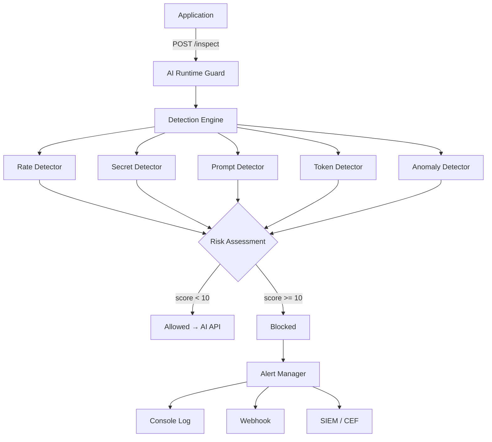

# AI Runtime Guard

**Runtime security monitoring for AI APIs — detect misuse, abuse, and attacks before they cause harm.**

---

## Overview

AI Runtime Guard is a security gateway that sits between your application and AI APIs (OpenAI, Anthropic, etc.). Every request is inspected in real time by multiple detectors that look for secrets, injection attacks, rate abuse, and behavioral anomalies. Suspicious requests are flagged, scored, and alerted — before they reach the AI provider.

---

## Architecture



---

## Detectors

| Detector | What It Catches | Severity |
|----------|----------------|----------|
| **Secret Detector** | API keys, passwords, private keys, PII (emails, SSNs, credit cards) in prompts | `HIGH` |
| **Rate Detector** | Request frequency exceeding per-user/per-IP threshold | `MEDIUM` |
| **Prompt Detector** | Prompt injection attacks (instruction override, role manipulation, jailbreaks) | `HIGH` |
| **Token Detector** | Abnormally high token estimates (denial-of-wallet) | `MEDIUM` |
| **Anomaly Detector** | Behavioral deviations from per-user baselines (new models, token z-score outliers) | `LOW` / `HIGH` |

---

## Quick Start

### Install

```bash
pip install -r requirements.txt
```

### Configure

Create a `.env` file (or export directly):

```env
APP_NAME=ai-runtime-guard
LOG_LEVEL=INFO
ALERT_WEBHOOK_URL=https://hooks.slack.com/services/YOUR/WEBHOOK/URL
RATE_LIMIT_RPM=60
TOKEN_ANOMALY_THRESHOLD=10000
ENABLED_DETECTORS=rate,secret,prompt,token,anomaly
```

### Run

```bash
uvicorn main:app --reload --port 8000
```

### Send a Request

```bash
curl -X POST http://localhost:8000/inspect \
  -H "Content-Type: application/json" \
  -d '{
    "user": "caleb",
    "model": "gpt-4",
    "prompt": "Hello, how are you?",
    "source_ip": "192.168.1.100",
    "token_estimate": 15
  }'
```

### Response

```json
{
  "events": [],
  "risk_score": 0,
  "allowed": true
}
```

---

## API Endpoints

| Method | Path | Description |
|--------|------|-------------|
| `POST` | `/inspect` | Submit a request for inspection. Returns events, risk score, and allow/block decision. |
| `GET` | `/health` | Health check for monitoring and load balancers. |

---

## Risk Scoring

Each detector assigns a severity level which maps to a numeric score:

| Severity | Score |
|----------|-------|
| `LOW` | 1 |
| `MEDIUM` | 3 |
| `HIGH` | 6 |
| `CRITICAL` | 10 |

The **total risk score** is the sum of all detected events. Requests with a score **>= 10** are blocked.

---

## SIEM Integration

Events can be exported in **CEF (Common Event Format)** for Splunk, QRadar, ArcSight, and other SIEM systems:

```python
cef_string = alert_manager.to_cef(event)
```

Example CEF output:
```
CEF:0|ai-runtime-guard|AI_API_MISUSE|1.0|SECRET_EXPOSURE|SECRET_EXPOSURE|8|src=192.168.1.100 suser=caleb cs1=gpt-4 cs1Label=Model cs2=secret_detector cs2Label=Detector
```

---

## Project Structure

```
ai-runtime-guard/
├── main.py                  # FastAPI application
├── config.py                # Configuration management
├── models/
│   └── events.py            # AIRequest and SecurityEvent data models
├── detectors/
│   ├── secret_detector.py   # Credential and PII leakage detection
│   ├── rate_detector.py     # Request frequency monitoring
│   ├── prompt_detector.py   # Prompt injection detection
│   ├── token_detector.py    # Token anomaly detection
│   └── anomaly_detector.py  # Behavioral baseline analysis
├── monitor/
│   └── detection_engine.py  # Orchestrates all detectors
├── alerts/
│   └── alert_manager.py     # Routes events to webhooks/SIEM
├── architecture.md          # System architecture diagrams
├── PROGRESS.md              # Development progress summary
├── STATS.md                 # Project statistics
├── requirements.txt         # Python dependencies
└── README.md                # This file
```

---

## Roadmap

- [ ] Request Monitor — intercept real API traffic automatically
- [ ] Response Monitor — inspect AI responses for data leakage
- [ ] Dashboard — real-time visualization of detections and metrics
- [ ] Persistent Storage — database for historical event analysis
- [ ] ML Detector — LLM-based detection for sophisticated attacks
- [ ] Cost Tracking — real-time API cost monitoring and budget alerts

---

## License

MIT - Need to flesh this out
