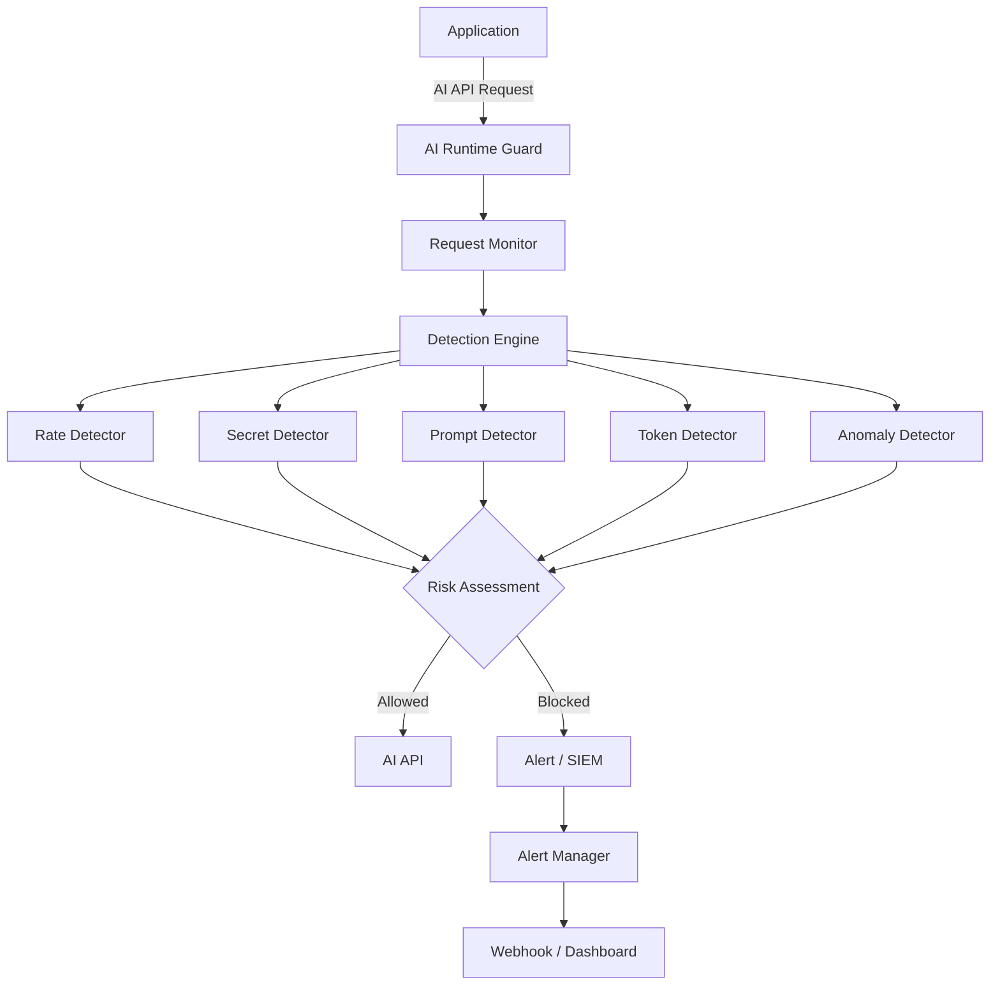
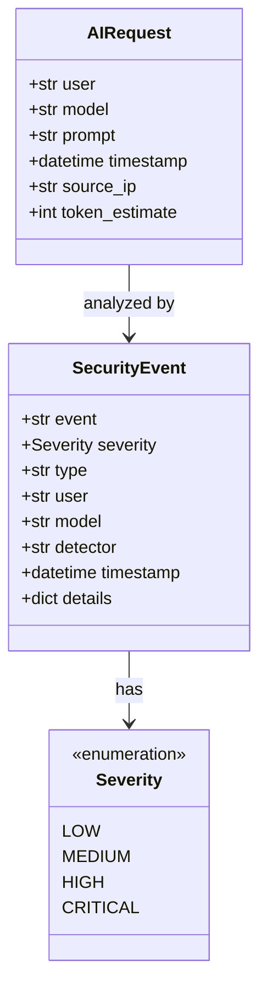

# AI Runtime Guard — Architecture

## System Flow

## Component Overview

| Component | Purpose |
|-----------|---------|
| Request Monitor | Intercepts and normalizes incoming AI API requests |
| Detection Engine | Orchestrates all detectors and aggregates results |
| Rate Detector | Flags abnormal request frequency per user/IP |
| Secret Detectector | Detects credentials, API keys, and PII in prompts |
| Prompt Detector | Identifies prompt injection attempts |
| Token Detector | Flags abnormal token consumption |
| Anomaly Detector | Statistical behavioral analysis per user |
| Alert Manager | Routes security events to webhooks, SIEM, or dashboard |

## Data Model

